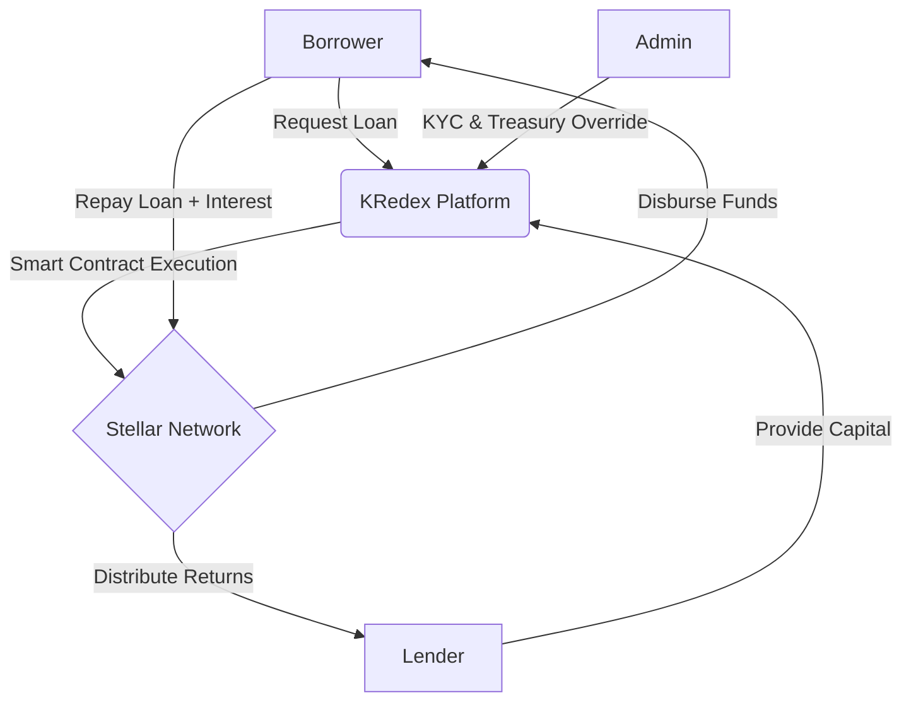
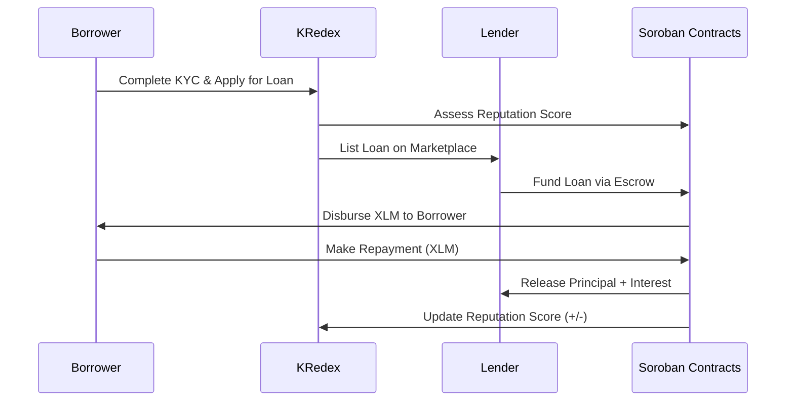

<p align="center">
  
</p>

<h1 align="center">KRedex</h1>

<p align="center"><em>Secure and Easy P2P Lending and Borrowing — Built on Trust.</em></p>

<p align="center">
   
   
   
   
   
   
</p>
<p align="center">
  <a href="https://github.com/thisisouvik/kredex/actions/workflows/frontend.yml">
    
  </a>
  <a href="https://github.com/thisisouvik/kredex/actions/workflows/smart-contracts.yml">
    
  </a>
  <a href="https://github.com/thisisouvik/kredex/actions/workflows/security.yml">
    
  </a>
</p>
<br>

---
<p>
  <strong>Live Platform:</strong> <a href="https://kredex.vercel.app/">https://kredex.vercel.app/</a><br/>

  <strong>Demo Video:</strong> <a href="https://youtu.be/5tPY8XqotMM">https://youtu.be/5tPY8XqotMM</a><br/>

  <strong>Documentation Guide:</strong> <a href="https://kredex-docs.vercel.app">https://kredex-docs.vercel.app</a><br/>

  <strong>Pitch Deck:</strong> <a href="https://drive.google.com/file/d/1pajPQs91IRSjNYJGA9W5hUDOF5UMDevi/view?usp=sharing">View Presentation</a>
</p>


---

## 🛑 The Problem

Traditional credit systems exclude billions of underbanked individuals due to rigid collateral requirements and centralized, high-friction processes. This leads to a massive liquidity gap where capital cannot reach the people who need it most for micro-enterprises, education, and personal growth. Without a traditional credit score, millions are trapped outside the financial system.

## 💡 How KRedex Solves This

**KRedex** decentralizes lending by using **on-chain reputation** instead of over-collateralization. By combining Stellar's low-fee infrastructure, SEP-12 KYC compliance, and Soroban smart contracts, KRedex creates a transparent environment where borrowers build creditworthiness over time based on their real repayment history. Lenders are protected through escrow contracts, dynamic risk models, and automated defaults, allowing seamless and secure peer-to-peer liquidity.

## 🌍 Real World Example

A small business owner in an emerging market needs $500 for inventory but lacks traditional bank collateral. Through KRedex, they verify their identity (KYC) and borrow smaller amounts first (e.g., $50). As they repay on time, their on-chain reputation score increases, unlocking the $500 loan with lower interest rates. Meanwhile, a lender on the other side of the world funds this loan directly, earning a solid yield on their capital with full blockchain transparency.

## 💼 Business Model & Advantages

**How KRedex Earns:** 
The platform generates revenue by charging a small protocol fee (e.g., 1-2%) on successfully funded loans and a fractional performance fee on the yield generated from automated liquidity pools.

**Lender Advantages:**
- Access to higher yields compared to traditional savings.
- Diversified risk across borrower pools.
- Ability to earn AQUA token incentives for providing liquidity.

**Borrower Advantages:**
- Access to uncollateralized capital.
- Lower interest rates for good behavior (gamified via Soulbound NFTs).
- A verifiable on-chain credit history that belongs directly to the user, not a centralized credit bureau.

---

## 📝 Feedback & Responses

We actively listen to our users! 
- **Feedback Form:** [Google Forms Link](https://forms.gle/mKWhbRfxiwmz4Xq39)
- **Response Sheet:** [View Public Responses](https://docs.google.com/spreadsheets/d/19hxZuHfau7Sep72jodHftfQLI5oRAlXVTWuvUDdSRFg/edit?usp=sharing)

### User Feedback Action Report

| Full Name | Wallet Address | Type of User | Feature like most | Feature it's lacking | Specific feedback or suggestion | GitHub Commit Link |
|---|---|---|---|---|---|---|
| Souvik Mandal | GAG3SUKHIF7VAWGTDRH52XETMLZXXNXBAZLLXHSLXAQPOBBCN43YLKR4 | Borrower | Hassle free easy p2p lending | Its fine for me. | Improvement regarding KYC must needed and strict to prevent scams. | [`4c60777`](https://github.com/thisisouvik/trustlend-mainnet/commit/4c60777) |
| Soumen Das | GCPH35WGDYMWPQDAPRWE3CTJNT7BHXAHQTRKUJLX3DTWVRGZIXSBOO74 | Borrower | Sign Up | N/A | Need ui improvement and add more information, so users can easily understand. | [`1824c2c`](https://github.com/thisisouvik/trustlend-mainnet/commit/1824c2c) |
| Shubam Dutta | GB3HF2ITUINWMX47PV65KDUXEIXVS4NPQVUGSLUSSVQB26ZHH63D5JBB4 | Borrower | Easy Borrowing | I don't think anything is lacking but the dashboard UI could be done much better. | - | [`1824c2c`](https://github.com/thisisouvik/trustlend-mainnet/commit/1824c2c) |
| Sumit Kumar | GDXRHYMYYF3ISS4JPQVZHHBHT7EVLAXFYCARK4HEXEQJ63HLMTK2OZ5I | Lender | Like the walkthrough for beginners. | I feel it's nice not much lag and also response time is good. | Make a mobile application for this too. | - |
| Lohit Mishra | GDYWYDOBPPM2XFQS2N7OA2XYO66C24OSBDGASSYAU7V3V4UHFIQYWCRL | Lender | portfolio could be most usefull feature find the ways to enhance those | on site at lenders page its showing usdc but we are making transaction on xlm | So mainly do change the transaction rate USDC-XLM or make the application xlm | [`8f6e707`](https://github.com/thisisouvik/trustlend-mainnet/commit/8f6e707) |
| najmi | GB42MHRFP3SPFZ37HFAARZMEK6IS5U7GXIBQIFD3UWWDUBHJO5GAWS7D | Lender | POOL FACILITY FOR LENDERS ( PASSIVE INVESTMENT) | nothing, all the feature is still good | noting | - |
| Rohit Maity | GA4DBFJ7O7VXZDFFP3DARCCQHZLVTDD4YBLS4KKLYHT2BDA3S5MEMA67 | Borrower | Loved the hassle free P2P lending | Trust Score needed to be worked the logic currently are not clear for it. | Good Platform, but it will be much better if the scoring logic will be better. | [`809acaf`](https://github.com/thisisouvik/trustlend-mainnet/commit/809acaf) |
| Saurav Suman | GCX3LFQ2BXHVEVL5VD7DZ4Y3R6WIUNUTJNZRMGRMWLM33XD2J7YFFLQA | Lender | Pool Investment facility and interest earn yielding opportunity | Its dashboard UI can be much better. | - | [`1824c2c`](https://github.com/thisisouvik/trustlend-mainnet/commit/1824c2c) |
| Aditya Jha | GALK4MID2BKRGDIFYAGRBJ3P2ZDSQJQASWMFAEMP25DPO2O5ISMXVTTB | Borrower | Locking feature like a user can't lend and borrow at the same time. | In KYC system please secure it more. | - | [`4c60777`](https://github.com/thisisouvik/trustlend-mainnet/commit/4c60777) / [`1824c2c`](https://github.com/thisisouvik/trustlend-mainnet/commit/1824c2c) |
| Rupam Ghosh | GBV4FZVZKT26JNLAIMGSNUDDREZLP4ESPOMDA4X6LGBTLUP5XAP73TXI | Lender | Lending | No | No issues | - |
| Amitabh Dey | GA3EHDIPTPLQTQESCNR4TSJYBSERD57KERCNFHGWEJ5OX2XSWTMJO424 | Lender | the borrow and lending feature is so good | nope | no its way smooth for any bugs | - |
| pritam mondal | GATJMD6BGNK4FQYNFWB354N7RP4XHA2R74GNSYM472ALNLJFX7NXBS3X | Borrower | well design applicaiton | need uiux more improvement | - | [`f5a7453`](https://github.com/thisisouvik/trustlend-mainnet/commit/f5a7453) / [`104ea11`](https://github.com/thisisouvik/trustlend-mainnet/commit/104ea11) |
| Sayan Sadhukhan | GCVT3KDQT3Z2JPWODBMHLX4ODSIKDZ7CTZYZTKHXIQLTWLF5TBRNXJHC | Borrower | The decentralized micro-lending workflow | transaction history with explorer links, real-time notifications | adding clearer loading indicators | [`8d245a5`](https://github.com/thisisouvik/trustlend-mainnet/commit/8d245a5) / [`104ea11`](https://github.com/thisisouvik/trustlend-mainnet/commit/104ea11) / [`1dca5ed`](https://github.com/thisisouvik/trustlend-mainnet/commit/1dca5ed) |
| Elijah Negasi | GDT2V3UDWS2EY4LYI7CGOOV27ATSZOSYG5HGJO66UVAIIKR2MO5LXMU2 | Both | Applying for a loan | I think its very straightforward | No errors nor bugs so far. | - |
| Samuel | GAIR676G75LUM52NOVVB25UOSOR6ESYUP5OPEU6ZEFBK5CHGMA5C6WRE | Borrower | To be able to borrow | Nah | No | - |
| Mustafa Çolak | GBUJJIYNPOC57O6CIFKFOBLPNTS6I5IYNGO5XQY7DAIPQ6JCU7ZBV7LN | Both | The clean user interface | simple analytics/history charts | No bugs encountered so far! | [`1dca5ed`](https://github.com/thisisouvik/trustlend-mainnet/commit/1dca5ed) |
| Shashi verma | GCDLL4UXPHVPK6PHNINQ2J3EK5EA6P56Q7MZYPWOBJLERNSOSVBP7R2M | Both | The on-chain reputation score | detailed loan/risk dashboard | able to copy own wallet address | [`6aac61a`](https://github.com/thisisouvik/trustlend-mainnet/commit/6aac61a) / [`f5a7453`](https://github.com/thisisouvik/trustlend-mainnet/commit/f5a7453) |
| Sadiya Mulani | GBTCGV43NLHEEBMCA5DWFZT6GOJYYCPHXNOEALTBQ7TREIQKQQAVLYT4 | Borrower | Clean UI | Nothing, everything is perfect. | No | - |
| Arihant Sen | GDX4565AJ4DBGP3HGDIV7F6QJ3IPOVDLG3BOXTHS5ITWKJMEWND3Y7HK | Borrower | easy onboarding experience | landing page is incomplete. Key elements like contact details, a footer | - | [`5c14b5a`](https://github.com/thisisouvik/trustlend-mainnet/commit/5c14b5a) |
| Rizwan Moulvi | GDCP2LXKUNBHFV4FPG4SDRIIQ5WVJ2OWH7WJWBHOK5TCNXKSDI74O32G | Borrower | Account can be opened simply | Its good and useful | transection verify link after transaction is not working | [`8d245a5`](https://github.com/thisisouvik/trustlend-mainnet/commit/8d245a5) |
| Aritra Mondal | GCKCB3VVRFWTDIIQ6E2VFRIKCGE4CZEWHWZJCLWCPG37VGAPMKWNW4TW | Lender | Walkthrough for beginners | Risk Dashboard is empty | risk dashboard need to be checked | [`f5a7453`](https://github.com/thisisouvik/trustlend-mainnet/commit/f5a7453) |
| Anirban Saha | GCCOAGPSAKD5E6ES2DIU64NXWG6O4M4HP5JXFMYLV3NR5SXOX2TCWEDQ | Lender | pool invested | no such thing | no | - |
| Ashmit Tiwari | GAPVN4B4EYFBFR5GKKKAITUXPUWWZ7VQCWK7273A2MT46K7ZBA4ILITI | Borrower | Sigh up | Nothing | Txn hash link after giving loan is not giving me properly result | [`8d245a5`](https://github.com/thisisouvik/trustlend-mainnet/commit/8d245a5) |
| Prakhar Deshpandey | GCVODPBH7PNE6AENNEYO6PFDH3VSF5JKYH6ULN3ZICROIWYAGJWLXSJY | Lender | Every transection is smooth | Platform is useful for me | NA | - |
| Md. Nadeem Ali | GD37TTSTX22Y24CAKWO45IKKHEMDYVEK7MEE7QC6C4O6VAIDXCEK4VL4 | Both | The clean UI Interface | make the wallet address can be copied | No its good form my side | [`6aac61a`](https://github.com/thisisouvik/trustlend-mainnet/commit/6aac61a) |
| Sangram Sen | GALKUNV3QKBIP37JCQXXDOCZBRKBCA52JRCOH2442GHSRHOWG3RPPWTL | Lender | I tried the KYC feature | KYC can be done in a better way | KYC asking same question make it one time | [`1dca5ed`](https://github.com/thisisouvik/trustlend-mainnet/commit/1dca5ed) |
| Vansh Dhiwar | GBFQZ6B257O6L5IQ523ZA33QGGL5DKEJEXEPNZS56F7YZDKJUK2WH23W | Lender | The walkthorugh feature | not that i can think of | maybe add a light dark mode toggle | [`104ea11`](https://github.com/thisisouvik/trustlend-mainnet/commit/104ea11) |
| Manish Dasgupta | GC22Z2IN3ROLZFW3JEU64C4IZZ74Z5RZWOG4OO64FJPKNMS77GZGVBMA | Borrower | Borrowing and KYC | i didn't find any | NA | - |
| Joy Pal | GDQJ7VPDOB247LD6D4QD6UQIYBKNVFU7UKNJGE55K77S23XMG77NEY33 | Lender | Pool Investment | Nothing it good | NA | - |
| Ratul Sarkar | GC2Q4MY3MWAV4TUVXXTYPPHC2OV55E7HNRDDMGD4VMOQLQKJGQRGSW3B | Lender | Lending UX flow | everything is good | in the history txn hash is not showing | [`8d245a5`](https://github.com/thisisouvik/trustlend-mainnet/commit/8d245a5) |
| Satish Rajput | GAS6ZE6F6JD7VKPXHAHFIJ4WXEQHH5WEEKBNNMZSN4T3IPWJQWGNDP6R | Both | Each step txn hash verify | I didn't find any | The contact section is to be recommended | [`5c14b5a`](https://github.com/thisisouvik/trustlend-mainnet/commit/5c14b5a) |
| Mainak Banerjee | GC5J6BN4BXXNE6DR6OHJSRH4WH4EZEFIO4AM2KRNFZEA5DCI3QFKODKA | Borrower | Walkthrough for beginers | No and it is very useful for micro lending | No | [`bbd2316`](https://github.com/thisisouvik/trustlend-mainnet/commit/bbd2316) |
| Md. Soheb | GBQWJUMYCSE63MT2XBAYK4BMMAJJFNTOR46QGPST4BLSPWBNGLU6FFHD | Lender | Dashboards and pool | The KYC needed to make strong... | KYC policy and progress need to work on | [`1dca5ed`](https://github.com/thisisouvik/trustlend-mainnet/commit/1dca5ed) |
| Purba Das | GBJA4Z6IXQLVZWMM3U7C7PFRFHWO7CZ3S62SPC6TX2NLV4XS2MQHBC4F | Borrower | Just like the easy onboarding and easy lending. | No such walk through helped me... | NA | [`bbd2316`](https://github.com/thisisouvik/trustlend-mainnet/commit/bbd2316) |
| Udanshu Ghosal | GC5TRX7OLZP57WKSLIACKAXO7YGHR4NI4BSS3SR3NQDMJL3JDSF7WZJ4 | Lender | Loan and Easy return overall UI is good and user-friendly | No its all good platform is transparent that's all. | No | - |
| Souvik Khan | GDFEYX5Q7UT4ZUREVHPULKYD6C3EKWQDTJY76OXYWTRTUE7PKUSKWJZG | Borrower | All features are good. | Everything looks cool. | no its smooth | - |
| Sandhyia Parui | GAXPJXWRLLZWRGJWYDWM7ZQ4RBV77CKRN6BZYPBK7IWLBB7MLUS6P2T3 | Both | Fast transactions and verify link on each steps. | No all the features are good. | The numbers in dashboard are not properly updating for me check that once. | [`4691821`](https://github.com/thisisouvik/trustlend-mainnet/commit/4691821) |
| Sk. Saif Ali | GDJGF2DQY4Q3RZY3OYAYGETO3SGRKY3KNRSHLZTKLQ7WUIAX5RJXIM3X | Lender | User onboarding sign up experience is very smooth no such hassle. | I think USDC should also be added... | USDC support is suggested. | `Pending (Mainnet)` |
| Subho Haldar | GC23LEPSSBJL4VJK6LK5RIRRX2ZKJ3OTVXHJT6HSWPMZ4JJDXE3ZRUPE | Lender | pool investment and UI visuals especially graph is great here. | No its all good Pool Invest is good way of passive investment | No bugs got | [`4691821`](https://github.com/thisisouvik/trustlend-mainnet/commit/4691821) |
| Md. Kaif | GDYF2MPWHTXE63DVLGG3H4JKTCBQ24OZAMGMLBMYY3IEIJLOCVD5CZDU | Lender | I lend and the experience was good. | no its good | I think the page is not getting refreshed after taking loan... | [`bbd2316`](https://github.com/thisisouvik/trustlend-mainnet/commit/bbd2316) |
| Shrey Tharu | GC3AS7YUTNG5V6OBWIEDDWTFPVZT3DFAYTXUWEYJTXTNXPCE4TVO4Q6T | Both | I like that once a borrower can't lend until loan is clear | Every feature is good | No | - |
| Subrata Saha | GCSHXA2QD4RS35O2D7OCIRUT6ONNHDWN42YAFTQUT6NWGKGCUGBASQNQ | Lender | Pool Investment | Transaction verify from app | NO bugs encountered | [`b174e2f`](https://github.com/thisisouvik/trustlend-mainnet/commit/b174e2f) |
| Sarukh Seikh | GAJUWETQPUT4RH6BHWDQOMC6EPTMMW4Q3IW46KSMCZLN7Y25NCLQBOV3 | Borrower | Trust Score based borrowing | No | no errors encountered | [`809acaf`](https://github.com/thisisouvik/trustlend-mainnet/commit/809acaf) |
| Subhajeet Saha | GBA6F4HQIJ6UY7WXUH2KRMHYIVX57MRFWZP7QS7EB267MYCKJARMH6UP | Both | smooth transactions and UI loading is great | All are working | add a documentation section for this product | [`bbd2316`](https://github.com/thisisouvik/trustlend-mainnet/commit/bbd2316) |
| Ayush Nandi | GAREG55YYVOTXCA6MK3RKMFNJ2VPNIET3VIEFFJTCQAVFUHFI6CDVGPN | Borrower | Trust based borrowing | Trust score to be enhanced a bit. | No bugs | [`809acaf`](https://github.com/thisisouvik/trustlend-mainnet/commit/809acaf) |
| Kuntal Jha | GDAUYKURO274AJDEBF5JZDUP5RDBQM6PGUSRVZ7LVSPU25HMBRUQRPY6 | Borrower | I love it that initially there is limitation on loan amount so thinking was good. | No its good | KYC UI could be more better I think there is something issue with that | [`1dca5ed`](https://github.com/thisisouvik/trustlend-mainnet/commit/1dca5ed) |
| Nabanita Mahanto | GC5TRX7OLZP57WKSLIACKAXO7YGHR4NI4BSS3SR3NQDMJL3JDSF7WZJ4 | Borrower | Over UI is good and no lag | landing page is need to work upon | NA | [`5c14b5a`](https://github.com/thisisouvik/trustlend-mainnet/commit/5c14b5a) |
| Subhra Banerjee | GB23YPDN4ZLLFHTLKMTRBGEGI37GPGYXHMCORML35PD7SQA5XKKE2PWA | Both | Walkthrough for beginners | Its useful for micro lending | No bugs everything is smooth | [`bbd2316`](https://github.com/thisisouvik/trustlend-mainnet/commit/bbd2316) |
| Ismail Rehman | GBYIJRF5CW4QG3XBETDBCNS3K7R65CEDNB4J3QBWKEIPVWMU6MKNIPW6 | Borrower | Everything is clean | No all the features are working and fine | No error I got | - |
| Tarik | GDDLLEWZE3IZKVHOOPZ2ZVQMJ2HOYFGCHEKMJA3PXY2J7TPK5GDDDQYL | Lender | passive invest options | all are good and the onboard is something I liked about this product | No | - |
| Harsh Pandey | GDBXA3NAGRLTYP7NI6EIS4QT273UUWHZYN4KCO7JT2E5VYYBSG2CQFYJ | Borrower | Trust Scoring | I can borrow small amount with little fees and interest and hassle free. | on the top the wallet card on clicking disconnect feature is showing bug. | [`91284e9`](https://github.com/thisisouvik/trustlend-mainnet/commit/91284e9) |
| Asim Das | GDNWLN3JLOCPWWL3WNXKN5PNPHDCJVJR2337VCK3NFK3HCXIDLU2QERC | Borrower | Micro lending and repaying also the interest is very less | All the features are working | No issues with the app | - |
| Gourish Debnath | GB3G5ZU7BL3PXWZIOJIETBF6FROFEMZVJJVRUUBTZVNRMLJAQPNPLK5Q | Both | KYC verification is actually a great initiative. | KYC was very useful it builds sense of trust for the lenders and borrowers | No all are working fine | [`1dca5ed`](https://github.com/thisisouvik/trustlend-mainnet/commit/1dca5ed) |

---

## 📸 Platform Previews

<p align="center">
  
  <br/><em>Main Dashboard - The gateway to KRedex.</em>
</p>

### 🔐 Authentication
<p align="center">
  
  <br/><em>Seamless Wallet and Passkey Authentication.</em>
</p>

### 👤 Borrower Dashboard
<p align="center">
  
  <br/><em>Borrower Home - Quick overview of credit and active loans.</em>
</p>
<p align="center">
  
  <br/><em>Apply for a new loan directly on-chain.</em>
</p>
<p align="center">
  
  <br/><em>On-chain Reputation and Trust Score management.</em>
</p>
<p align="center">
  
  <br/><em>Flexible repayment options through escrow.</em>
</p>
<p align="center">
  
  <br/><em>Complete transaction history for the borrower.</em>
</p>
<p align="center">
  
  <br/><em>Profile management and verification status.</em>
</p>

### 🏦 Lender Dashboard
<p align="center">
  
  <br/><em>Lender Home - Track your capital and yield.</em>
</p>
<p align="center">
  
  <br/><em>Direct P2P Loan Marketplace for targeted investments.</em>
</p>
<p align="center">
  
  <br/><em>Automated Liquidity Pools for diversified exposure.</em>
</p>
<p align="center">
  
  <br/><em>Detailed breakdown of your lending portfolio and profits.</em>
</p>
<p align="center">
  
  <br/><em>Full chronological ledger of your deployed capital.</em>
</p>
<p align="center">
  
  <br/><em>Lender settings and configuration.</em>
</p>

### 🛡️ Admin & Treasury
<p align="center">
  
  <br/><em>Admin Overview - Platform health and key metrics.</em>
</p>
<p align="center">
  
  <br/><em>Global treasury movement and transaction volume.</em>
</p>
<p align="center">
  
  <br/><em>SEP-12 compliance and identity verification review.</em>
</p>
<p align="center">
  
  <br/><em>User management and platform segmentation.</em>
</p>

### Analytics 

<p align="center">
  
  <br/><em>Traffic on the website</em>
</p>

### 📱 Mobile Experience
<p align="center">
  
  
  <br/><em>Responsive mobile experience for lending on the go.</em>
</p>

---

## 🛠️ Tech Stack Details

| Category | Technology | Description |
| :--- | :--- | :--- |
| **Frontend** | Next.js 16, React 19 | App Router, Server Actions, modern UI components. |
| **Styling** | Tailwind CSS 4 | Utility-first styling for beautiful responsive design. |
| **Backend & DB** | NeonDB (Serverless Postgres) + Prisma ORM | Serverless relational database with type-safe schema and migrations. |
| **Caching** | Upstash Redis | High-speed caching for reputation scores and RPC requests. |
| **Blockchain** | Stellar SDK, Freighter | Native Stellar network integration and wallet signing. |
| **Smart Contracts** | Soroban (Rust) | WASM-compiled contracts for core lending logic and escrow. |

---

---

## 🔗 Stellar Blockchain Integration

KRedex is deeply integrated with the Stellar network. All core financial operations (loan creation, repayments, escrow locking, and pool withdrawals) are executed as real on-chain Stellar transactions.

### SDK Usage
The `@stellar/stellar-sdk` (v16.0.1) is a direct dependency listed in `package.json`. It powers:
- `TransactionBuilder` — builds raw Stellar/Soroban transactions
- `Contract` — invokes specific Soroban contract entry points
- `Operation.invokeHostFunction` — assembles Soroban host function calls
- `SorobanDataBuilder` — attaches simulation resource footprints
- `xdr`, `Address`, `nativeToScVal`, `scValToNative` — XDR encoding/decoding

### Frontend Integration Files
All contract interaction lives in `lib/stellar/` and `lib/contracts/`:

| File | Purpose |
| :--- | :--- |
| `lib/stellar/soroban.ts` | Core engine: builds, simulates, signs (Freighter), and submits Soroban transactions via raw JSON-RPC |
| `lib/contracts/reputation.ts` | TypeScript client for `BorrowerReputationContract` — `get_profile`, `init_borrower`, `add_reputation_event`, `freeze_account` |
| `lib/contracts/lending.ts` | TypeScript client for `LendingContract` — `create_loan_request`, `approve_loan`, `record_payment`, `mark_defaulted` |
| `lib/contracts/escrow.ts` | TypeScript client for `EscrowContract` — `create_hold`, `release_funds`, `cancel_hold` |
| `lib/contracts/default.ts` | TypeScript client for `DefaultManagementContract` — default phase transitions and insurance events |
| `lib/contracts/generated/` | Auto-generated type-safe bindings via `stellar contract bindings typescript` for all 4 contracts |
| `lib/stellar/batch-disburse.ts` | Batch payment operations using `Stellar Disbursement Platform` for admin bulk-funding |

### Frontend-to-Contract Function Matching

| Frontend Call | Contract Entry Point | Contract |
| :--- | :--- | :--- |
| `ReputationContract.getScoreSafe()` | `get_profile` (simulation) | `borrower_reputation` |
| `ReputationContract.initBorrowerProfile()` | `init_borrower` | `borrower_reputation` |
| `ReputationContract.addReputationEvent()` | `add_reputation_event` | `borrower_reputation` |
| `ReputationContract.getMaxLoan()` | `calculate_max_loan` (simulation) | `borrower_reputation` |
| `ReputationContract.getInterestRate()` | `calculate_interest_rate` (simulation) | `borrower_reputation` |
| `LendingContract.createLoanRequest()` | `create_loan_request` | `lending` |
| `LendingContract.approveLoan()` | `approve_loan` | `lending` |
| `LendingContract.recordPayment()` | `record_payment` | `lending` |
| `LendingContract.markLoanDefaulted()` | `mark_defaulted` | `lending` |
| `EscrowContract.createEscrowHold()` | `create_hold` | `escrow` |
| `EscrowContract.releaseFunds()` | `release_funds` | `escrow` |

### Transaction Flow
Every write operation follows this 7-step flow in `lib/stellar/soroban.ts`:
1. **Fetch** account sequence number from Horizon REST API
2. **Build** a simulation transaction locally (no broadcast)
3. **Simulate** via `simulateTransaction` JSON-RPC to get resource footprint
4. **Assemble** a final transaction with correct fee and Soroban data
5. **Sign** with Freighter wallet (`@stellar/freighter-api`)
6. **Submit** via `sendTransaction` JSON-RPC
7. **Poll** `getTransaction` until `SUCCESS` or `FAILED`

- **Soroban Smart Contracts:** Deployed natively on Stellar Testnet for executing decentralized logic (Reputation, Escrow, Lending).
- **Stellar Assets:** Uses native XLM for loans, repayments, and liquidity pools.
- **SEP-12 KYC Integration:** Native compliance out-of-the-box for all user onboarding.
- **Account Abstraction:** Smart Account Kit integration for seamless, passwordless passkey transactions.

---

## 📂 File Architecture

```text
kredex/
├─ app/                    # Next.js App Router (Pages, APIs, Server Actions)
│  ├─ api/                 # API Routes (KYC, Loans, Notifications)
│  ├─ dashboard/           # Role-based dashboards (Admin, Borrower, Lender)
│  └─ globals.css          # Global styling
├─ components/             # Reusable React UI components
│  ├─ dashboard/           # Dashboard specific widgets (Metrics, Forms, Tables)
│  └─ ui/                  # Core UI elements (Buttons, Modals, Loaders)
├─ contracts/              # Soroban smart contracts (Rust)
│  ├─ borrower_reputation/ # Reputation scoring logic
│  ├─ reputation_nft/      # Soulbound NFT badges
│  ├─ lending/             # Core loan logic
│  └─ escrow/              # Funds security
├─ lib/                    # SDKs, utilities, and integrations
│  ├─ stellar/             # Stellar SDK helpers and Soroban transaction engine
│  │  ├─ soroban.ts        # Core: build → simulate → sign → submit → poll
│  │  └─ batch-disburse.ts # Admin bulk-disbursement using Stellar SDK
│  ├─ contracts/           # TypeScript clients for all 4 Soroban contracts
│  │  ├─ reputation.ts     # BorrowerReputationContract client
│  │  ├─ lending.ts        # LendingContract client
│  │  ├─ escrow.ts         # EscrowContract client
│  │  ├─ default.ts        # DefaultManagementContract client
│  │  └─ generated/        # Auto-generated stellar-sdk bindings
│  ├─ auth/                # JWT-based session management and authorization
│  └─ prisma.ts            # NeonDB client via Prisma ORM
├─ prisma/                 # Prisma ORM schema and migrations
├─ public/                 # Static assets (Logos, Fonts, Images)
└─ types/                  # Shared TypeScript interfaces and types
```

---

## 🗺️ Project Workflows

### Core Platform Architecture

```mermaid
graph TD
  A[Borrower] -->|Request Loan| B(KRedex Platform)
  C[Lender] -->|Provide Capital| B
  B -->|Smart Contract Execution| D{Stellar Network}
  D -->|Disburse Funds| A
  A -->|Repay Loan + Interest| D
  D -->|Distribute Returns| C
  E[Admin] -->|KYC & Treasury Override| B
```

### User Transaction Flow

```mermaid
sequenceDiagram
  participant B as Borrower
  participant K as KRedex
  participant L as Lender
  participant S as Soroban Contracts
  
  B->>K: Complete KYC & Apply for Loan
  K->>S: Assess Reputation Score
  K->>L: List Loan on Marketplace
  L->>S: Fund Loan via Escrow
  S->>B: Disburse XLM to Borrower
  B->>S: Make Repayment (XLM)
  S->>L: Release Principal + Interest
  S->>K: Update Reputation Score (+/-)
```

---

## ✨ Features

| Feature | Description |
| :--- | :--- |
| **On-Chain Reputation** | Dynamic scoring where good borrowers earn reputation points tracked on Soroban. |
| **Soulbound NFTs** | High-reputation users receive non-transferable NFT badges (Gold/Platinum). |
| **Automated Liquidity Pools** | Lenders can deposit into automated pools for instant yield diversification. |
| **Stellar Disbursement** | Admins can fund up to 500 approved loans at once using the SDP engine. |
| **Passwordless Auth** | Login seamlessly using biometric Passkeys or Freighter wallet signatures. |
| **SEP-12 KYC Integration** | Out-of-the-box compliance acting as a native Stellar KYC server. |

---

## 📜 Smart Contracts

| Contract Name | Contract ID (Stellar Testnet) | Verification | Functionality |
| :--- | :--- | :--- | :--- |
| **Reputation** | `CCICPDIYJIRTMWSXSTLDBTEQXBIMALBLHODQJ62FAKSU3TKEFWBB4EZ7` | [🔗 Verify](https://stellar.expert/explorer/testnet/contract/CCICPDIYJIRTMWSXSTLDBTEQXBIMALBLHODQJ62FAKSU3TKEFWBB4EZ7) | Tracks user credit scores natively on-chain. |
| **Escrow** | `CBDVGF5KYW2SWP5XYIDNCQXSWDG7UYFXAR75SCOHTWDM3KR5NNZNR22S` | [🔗 Verify](https://stellar.expert/explorer/testnet/contract/CBDVGF5KYW2SWP5XYIDNCQXSWDG7UYFXAR75SCOHTWDM3KR5NNZNR22S) | Secures lender funds and manages collateral routing. |
| **Lending** | `CATWVUHA7SFVCAR4OTA7GXM4LOLCFSTXEXHMINM2BZYUCELWQG46BEBP` | [🔗 Verify](https://stellar.expert/explorer/testnet/contract/CATWVUHA7SFVCAR4OTA7GXM4LOLCFSTXEXHMINM2BZYUCELWQG46BEBP) | Core loan logic, interest calculation, and repayment terms. |
| **Default Mgmt** | `CACK4Q7YAXC3UTDJ74ERT54FUBXJJ5ZH73GL2S4WPM3Y6MOYZE2QUUZ5` | [🔗 Verify](https://stellar.expert/explorer/testnet/contract/CACK4Q7YAXC3UTDJ74ERT54FUBXJJ5ZH73GL2S4WPM3Y6MOYZE2QUUZ5) | Handles liquidation thresholds and insurance payouts. |
| **Liquidity Pool** |  `CAXX5Q7YAXC3UTDJ74ERT54FUBXJJ5ZH73GL2S4WPM3Y6MOYZE2QUUZ5` | [🔗 Verify](https://stellar.expert/explorer/testnet/contract/CAXX5Q7YAXC3UTDJ74ERT54FUBXJJ5ZH73GL2S4WPM3Y6MOYZE2QUUZ5) | Manages automated pool liquidity, LP token minting, and dynamic utilization-based interest rate modeling. |
| **Oracle Adapter** | *(Pending Testnet Deployment)* | N/A | Fetches off-chain price feeds for collateral health checks. |

*You can verify transactions and state for these contracts using the [Stellar Expert Testnet Explorer](https://stellar.expert/explorer/testnet).*


## 🚀 CI/CD Workflows

GitHub Actions workflows are defined in `.github/workflows/`.

### `ci.yml` — Continuous Integration & Deployment (runs on every push/PR to `main` and `dev`)

| Job | Steps |
| :--- | :--- |
| **Test Soroban Contracts** | Installs Rust with `wasm32-unknown-unknown` target → runs `cargo test` → compiles WASM with `cargo build --target wasm32-unknown-unknown --release` |
| **Build Next.js Frontend** | Installs Node 20 → `npm ci` → TypeScript check (`tsc --noEmit`) → `npm run lint` → `npm run build` |
| **Deploy to Production** | Runs conditionally on `main` branch → Validates `VERCEL_TOKEN` and deploys to Vercel via `npx vercel deploy --prod` → Prepares Soroban Smart Contract deployment to the Stellar Testnet via `stellar-cli` |

### `security.yml` — Security Scanning
Runs automated dependency and code vulnerability scanning on the frontend.

> All CI status badges can be seen on the GitHub Actions tab of this repository.

## 🛑 Error Handling

| Error Type | Detection Mechanism | Resolution / Fallback |
| :--- | :--- | :--- |
| **RPC Rate Limiting** | Next.js API interceptors catch `429 Too Many Requests`. | Upstash Redis caches RPC reads; exponential backoff implemented for writes. |
| **Soroban Execution Failure** | Freighter/Albedo rejects signature or contract panics. | Rollback Prisma database state; display user-friendly toast notification. |
| **Insufficient Liquidity** | Pool withdraw API checks balance before transaction. | Graceful UI rejection; alerts admin to rebalance treasury. |
| **KYC Verification Failed** | SEP-12 API webhook returns `REJECTED` status. | Locks borrower loan requests; prompts user to re-submit documents. |

---

## 🧪 Testing Guide

To test the KRedex platform locally:
1. **Prisma Studio**: Run `npx prisma studio` to view database tables and manipulate mocked data.
2. **Freighter Wallet**: Ensure your Freighter wallet is set to **Testnet** and funded via the Stellar Laboratory friendbot.
3. **Manual Testing**: Sign up normally at `/auth`, complete KYC, and use the borrower/lender dashboards to test all flows end-to-end.

### Testing Screenshots
<p align="center">
  
  
  <br/><em>Manual testing flows on the platform.</em>
</p>


---

## ⚙️ Project Setup Guide

**1. Prerequisites**
- Node.js 18+
- Rust toolchain (`rustup target add wasm32-unknown-unknown`)
- [Stellar CLI](https://developers.stellar.org/docs/build/smart-contracts/getting-started/setup)

**2. Install Dependencies**
```bash
npm install
```

**3. Environment Configuration**
Copy `.env.example` to `.env.local` and populate the necessary NeonDB, Redis, and Stellar keys.

**4. Database Setup**
```bash
npx prisma generate
npx prisma db push
```

**5. Run the Application**
```bash
npm run dev
```

---

## 🚀 Future Implementation on Mainnet

As KRedex transitions to the Stellar Mainnet, the following implementations are planned:
- **Fiat On/Off Ramps:** Integration with MoneyGram Access for seamless cash-to-crypto onboarding.
- **Stablecoin Integration:** Defaulting loans to USDC to mitigate XLM price volatility for borrowers and lenders.
- **Institutional Liquidity Pools:** Permissioned pools designed for institutional lenders with customized compliance requirements.

---

*Thank you for the opportunity. Love Building! ❤️*

